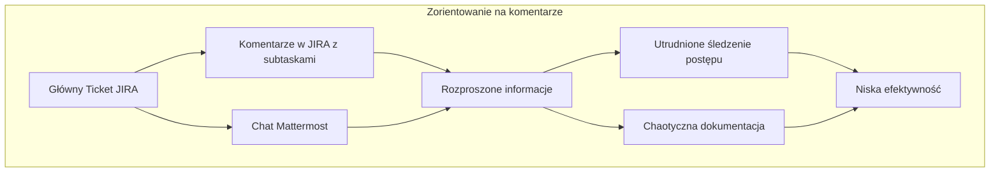
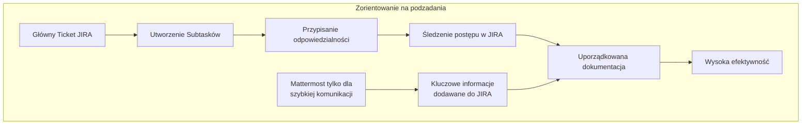
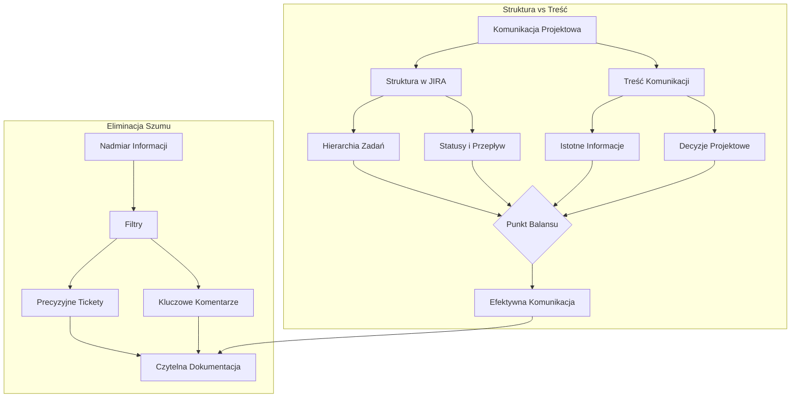

# komunikacja

## Czego unikać

### Lista zadan w zadaniu głównym

### Podzadania zamiast listy w zadaniu głównym

    
Jak można się komunikować w oparciu o zarządzanie zadaniami, statusami i zespołem przy użyciou jira i mattermost

# Balans w Komunikacji Projektowej: JIRA i Mattermost

## 1. Struktura JIRA jako Nośnik Informacji

### Znaczenie Struktury
- Sposób organizacji ticketów jest sam w sobie informacją
- Hierarchia zadań pokazuje zależności i priorytety
- Statusy odzwierciedlają rzeczywisty postęp prac

### Zasada Minimalnej Informacji
- Każdy ticket powinien zawierać tylko niezbędne informacje
- Struktura powinna być oczywista i intuicyjna
- Unikanie duplikacji informacji między ticketami

## 2. Efektywna Komunikacja w Mattermost

### Zasady Komunikacji
- Komunikacja skupiona na rozwiązaniach, nie na problemach
- Używanie wątków do grupowania powiązanych dyskusji
- Przenoszenie ustaleń do JIRA zamiast ich powielania

### Redukcja Szumu Informacyjnego
- Ograniczenie komunikacji do niezbędnego minimum
- Używanie odpowiednich kanałów dla różnych typów informacji
- Unikanie niepotrzebnych powiadomień i mentions

## 3. Praktyczne Strategie Balansu

### W JIRA
1. **Struktura Ticketów**
   - Jasna hierarchia: Epic > Story > Task > Subtask
   - Każdy poziom zawiera tylko właściwe dla niego informacje
   - Używanie relacji między ticketami zamiast opisów

2. **Zarządzanie Komentarzami**
   - Tylko istotne informacje wpływające na realizację
   - Decyzje projektowe i zmiany zakresu
   - Blokery i ich rozwiązania

### W Mattermost
1. **Organizacja Komunikacji**
   - Kanały tematyczne zamiast ogólnych
   - Krótkie, konkretne wiadomości
   - Linkowanie do JIRA zamiast opisywania zadań

2. **Priorytety Komunikacyjne**
   - Pilne sprawy wymagające natychmiastowej reakcji
   - Szybkie uzgodnienia techniczne
   - Koordynacja działań zespołu

## 4. Unikanie Chaosu Informacyjnego

### Strukturyzacja Informacji
1. **W JIRA**
   - Standardowy format opisów ticketów
   - Konsekwentne używanie etykiet i komponentów
   - Regularne aktualizacje statusów

2. **W Mattermost**
   - Zasada "jedna dyskusja - jeden wątek"
   - Podsumowywanie długich dyskusji
   - Przenoszenie wniosków do JIRA

### Eliminacja Nadmiaru
1. **Redukcja Komentarzy**
   - Tylko informacje zmieniające kontekst zadania
   - Unikanie dyskusji w komentarzach
   - Dokumentowanie tylko finalnych decyzji

2. **Optymalizacja Komunikacji**
   - Grupowanie powiązanych informacji
   - Używanie szablonów dla powtarzalnych informacji
   - Regularne czyszczenie nieaktualnych dyskusji

## 5. Praktyczne Wskazówki

### Do Wdrożenia
1. **Zasada 1-3-5**
   - 1 główny cel w tickecie
   - 3 kluczowe punkty w opisie
   - 5 maksymalnie komentarzy do rozwiązania

2. **Cykl Informacyjny**
   - Mattermost: szybka wymiana myśli
   - JIRA: dokumentacja ustaleń
   - Wiki: długoterminowa wiedza

### Monitorowanie Efektywności
- Regularne przeglądy komunikacji
- Optymalizacja procesów
- Zbieranie feedbacku od zespołu

## 6. Podsumowanie
- Struktura jest integralną częścią informacji
- Balans między szczegółowością a zwięzłością
- Systematyczne przenoszenie wiedzy do odpowiednich narzędzi
- Koncentracja na informacjach wspierających realizację zadań
- Ciągłe doskonalenie procesów komunikacji
